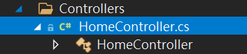

# MS MVC 
## naming convention
### url

According to a assistant co-worker.

If the project is developed with ASP.NET Core (MVC structure) with C# programming language, then 

1. url must consist of the following format.

```
http:<ipAddress>/<fileNameExecutedWithoutSuffixController>/<invokedMethod><queries>
```

where

```
<ipAddress> := ip address of server

<fileNameExecutedWithoutSuffixController> := the file name of server is running at present and then trim the suffix controller. 

<invokedMethod> := The method that is executed

<queries> := concept same as norm valid url.
```

#### example
##### example 1

When the server start to run, we can see the url is

```
http:<ipAddress>/Home/AdvIndex
```

Thus, we can imply backward that 

+ The server is running `HomeController` class defined in `HomeController.cs`.

> [!TIP]
> `C#` rules that a `C#` script file (`.cs`) must define only one namespace at top level >
> 
> and only one class is defined in the namespace where its class name
>
> must same as class name.




##### example 2
When user click an `add` button at a page, the url is

```
http:<ipAddress>/PdLawRegulationMaintain/Create
```

we can know that

+ the server is running the `Create` method of `PdLawRegulationMaintainController` class defined in `PdLawRegulationMaintainController.cs`.

```
    public ActionResult Create(string sid = null, string callfrom = null)
    {
        // ...
        return View(bean);
    }
```

then the user filling the form, and submit the form, try adding new record, the url is

```
http:<ipAddress>/PdLawRegulationMaintain/Create?sid=Excedeqwdcdwq
```

we can know that

+ the server is running the `Create` method of `PdLawRegulationMaintainController` class defined in `PdLawRegulationMaintainController.cs`.

```
        [HttpPost]
        [ValidateAntiForgeryToken]
        public ActionResult Create(PdLawRegulation bean, string sid = null,string callfrom = null,string dodgeid = null)
        {
            if (!ModelState.IsValid)
            {
                return View(bean);
            }
            // ...
            return View(bean);
        }
```

### reference
+ [General Naming Conventions](https://learn.microsoft.com/en-us/dotnet/standard/design-guidelines/general-naming-conventions)

+ [Part 2, add a controller to an ASP.NET Core MVC app](https://learn.microsoft.com/en-us/aspnet/core/tutorials/first-mvc-app/adding-controller?view=aspnetcore-9.0&tabs=visual-studio)